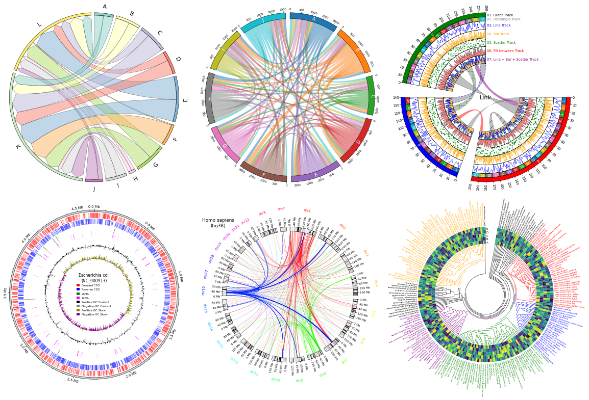

# pyCirclize: Circular visualization in Python


[](https://pypi.python.org/pypi/pycirclizely)
[](https://anaconda.org/conda-forge/pycirclizely)

## Overview

pyCirclize is a circular visualization python package implemented based on matplotlib.
This package is developed for the purpose of easily and beautifully plotting circular figure such as Circos Plot and Chord Diagram in Python.
In addition, useful genome and phylogenetic tree visualization methods for the bioinformatics field are also implemented.
pyCirclize was inspired by [circlize](https://github.com/jokergoo/circlize) and [pyCircos](https://github.com/ponnhide/pyCircos).

<figure markdown>
  
  <figcaption>pyCirclize example plot gallery</figcaption>
</figure>

## Installation

`Python 3.9 or later` is required for installation.

**Install PyPI package:**

```
pip install pycirclizely
```

**Install conda-forge package:**

```
conda install -c conda-forge pycirclizely
```

## API Usage

API usage is described in each of the following sections.

- [Getting Started](./getting_started/)
- [Plot API Example](./plot_api_example/)
- [Chord Diagram](./chord_diagram/)
- [Radar Chart](./radar_chart/)
- [Circos Plot (Genomics)](./circos_plot/)
- [Comparative Genomics](./comparative_genomics)
- [Phylogenetic Tree](./phylogenetic_tree/)
- [Plot Tips](./plot_tips/)
